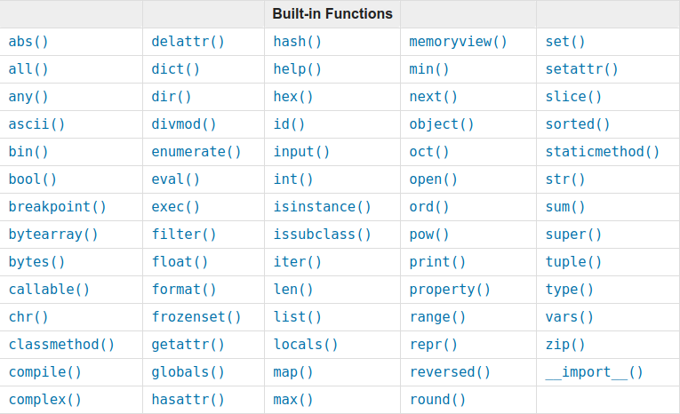

# In Built Functions

[For further reference click here](https://docs.python.org/3/library/functions.html)
## 1. help([object])
> Don't know what a function does!<br> 
> Use this in built function to know about it. 

Invoke the built-in help system. (This function is intended for interactive use.)

If no argument is given, the interactive help system starts on the interpreter console.
```bash
>>> help()
Welcome to Python 3.6's help utility!

If this is your first time using Python, you should definitely check out
the tutorial on the Internet at https://docs.python.org/3.6/tutorial/.

Enter the name of any module, keyword, or topic to get help on writing
Python programs and using Python modules.  To quit this help utility and
return to the interpreter, just type "quit".

To get a list of available modules, keywords, symbols, or topics, type
"modules", "keywords", "symbols", or "topics".  Each module also comes
with a one-line summary of what it does; to list the modules whose name
or summary contain a given string such as "spam", type "modules spam".

help>
```
```python
help> print

Help on built-in function print in module builtins:

print(...)
    print(value, ..., sep=' ', end='\n', file=sys.stdout, flush=False)
    
    Prints the values to a stream, or to sys.stdout by default.
    Optional keyword arguments:
    file:  a file-like object (stream); defaults to the current sys.stdout.
    sep:   string inserted between values, default a space.
    end:   string appended after the last value, default a newline.
    flush: whether to forcibly flush the stream.
```
>Press `q` to quit.

If the argument is a string, then the string is looked up as the name of a module, function, class, method, keyword, or documentation topic, and a help page is printed on the console.
```bash
>>> help(print)
Help on built-in function print in module builtins:

print(...)
    print(value, ..., sep=' ', end='\n', file=sys.stdout, flush=False)
    
    Prints the values to a stream, or to sys.stdout by default.
    Optional keyword arguments:
    file:  a file-like object (stream); defaults to the current sys.stdout.
    sep:   string inserted between values, default a space.
    end:   string appended after the last value, default a newline.
    flush: whether to forcibly flush the stream.
```
```bash
>>> help(abs)
Help on built-in function abs in module builtins:

abs(x, /)
    Return the absolute value of the argument.

```

If the argument is any other kind of object, a help page on the object is generated.


## 2. dir()
> Want to know what are the attributes and methods of a object?<br>
> Use this in built function to find out.

Without arguments, return the list of names in the current local scope.
```bash
>>> a = 1
>>> B = 2
>>> C = 3
>>> MY_SONGS = ["SONG1","SONG2"]
>>> dir()
['B', 'C', 'MY_SONGS', '__annotations__', '__builtins__', '__doc__', '__loader__', '__name__', '__package__', '__spec__', 'a']
```
With an argument, attempt to return a list of valid attributes for that object.
```bash
# To know the attributes and methods of string object.

>>> dir(str)
['__add__', '__class__', '__contains__', '__delattr__', '__dir__', '__doc__', '__eq__', '__format__', '__ge__', '__getattribute__', '__getitem__', '__getnewargs__', '__gt__', '__hash__', '__init__', '__init_subclass__', '__iter__', '__le__', '__len__', '__lt__', '__mod__', '__mul__', '__ne__', '__new__', '__reduce__', '__reduce_ex__', '__repr__', '__rmod__', '__rmul__', '__setattr__', '__sizeof__', '__str__', '__subclasshook__', 'capitalize', 'casefold', 'center', 'count', 'encode', 'endswith', 'expandtabs', 'find', 'format', 'format_map', 'index', 'isalnum', 'isalpha', 'isdecimal', 'isdigit', 'isidentifier', 'islower', 'isnumeric', 'isprintable', 'isspace', 'istitle', 'isupper', 'join', 'ljust', 'lower', 'lstrip', 'maketrans', 'partition', 'replace', 'rfind', 'rindex', 'rjust', 'rpartition', 'rsplit', 'rstrip', 'split', 'splitlines', 'startswith', 'strip', 'swapcase', 'title', 'translate', 'upper', 'zfill']

# Names starting and ending with __ are called dunders(short for double underscore).
```
Now we can use `help()` on any of the attributes to find out its functionality.
eg.
```bash
>>> help(str.endswith)
Help on method_descriptor:

endswith(...)
    S.endswith(suffix[, start[, end]]) -> bool
    
    Return True if S ends with the specified suffix, False otherwise.
    With optional start, test S beginning at that position.
    With optional end, stop comparing S at that position.
    suffix can also be a tuple of strings to try.
```


## 3. type()
> Want to know what type a object is and also to create a new object type.
> Use this inbuilt function.

If a single argument (object) is passed to type() built-in, it returns type of the given object. If three arguments (name, bases and dict) are passed, it returns a new type object.
```
type(object)
type(name, bases, dict)
```
### type(object)
With one argument, return the type of an object. The return value is a type object and generally the same object as returned by object.`__class__.`
eg:
```python
>>> a = 123
>>> type(a)
# a is a type of int
<class 'int'>

>>> b = "123"
>>> type(b)
# b is a type of string 
<class 'str'>

>>> c = ["song1","song2","song3"]
>>> type(c)
# c is type of list
<class 'list'>
```
> note: <br>
The `isinstance()` built-in function is recommended for testing the type of an object, because it takes subclasses into account.


### type(name, bases, dict)
With three arguments, return a new type object.

* `name`  : is the class name and becomes the `__name__` attribute;
* `bases` : itemizes the base classes and becomes the `__bases__` attribute;
* `dict`  : is the namespace containing definitions for class body and is copied to a standard dictionary to become the `__dict__` attribute.

